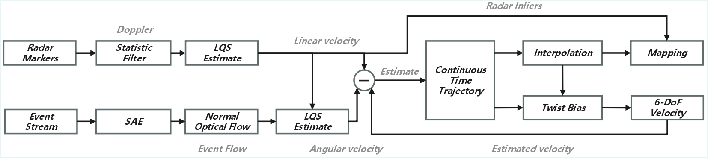

<div align="center">
    <h1>TwistEstimator</h1>
    <i>An Estimator for Ego-Motion Twist Using 4D-MMWave Radar Doppler and Asynchronous Event Streams</i>
    <br>
    <br>
<div>

| [🛠️ Installation](#) | [🎥 Video](https://www.youtube.com/watch?v=Mdt7_QYpk0I) | [📖 Paper](https://arxiv.org/pdf/2506.18443) |
|----------------------|------------------------------------------------------------|---------------------------------------------|


</div>
    <br>
    
    
<br>
</div>


## What is TwistEstimator
The TwistEstimator is designed to provide complementary 6-DoF velocity estimation. It leverages linear velocity from the millimeter-wave radar and angular velocity from event-based optical flow. By integrating these measurements within a continuous estimation framework, 6-DoF pose estimation is achieved. Additionally, the system simultaneously calibrates the external parameters and time delay between the millimeter-wave radar and event optical flow. A lightweight odometry solution is derived from the velocity loop.


## Supported Dataset
All data is available on Google Drive.

| Sequence | Lin.Max | Lin.Avg | Ang.Max | Ang.Avg | HDR  |
|----------|---------|---------|---------|---------|------|
| [dji1](https://drive.google.com/file/d/1EGjIECPkZvd0QPdd44wqjKFQG6J8gHRi/view?usp=drive_link)     | 4.49    | 4.01    | 0.34    | 0.16    | 62   |
| [dji2](https://drive.google.com/file/d/1gpAY3IG8W2JiQdmc44jdYIoEHjThT155/view?usp=drive_link)     | 4.51    | 3.47    | 0.54    | 0.16    | 63   |
| [dji3](https://drive.google.com/file/d/1HkrwU8Tt_KIp-s4vsAU1Hm6k6qTQM3EQ/view?usp=drive_link)     | 6.30    | 3.74    | 0.56    | 0.18    | 62   |
| [hand1](https://drive.google.com/file/d/1w3aQ0cOqPsKOPzxi3QeNO2J2JUdxIv21/view?usp=drive_link)    | 4.20    | 0.92    | 0.42    | 0.16    | 89   |
| [hand2](https://drive.google.com/file/d/1GY3R4VX5v_VCHj6gm-A6gUkf9ez0kjtJ/view?usp=drive_link)    | 2.32    | 0.87    | 0.45    | 0.17    | 92   |
| [hand3](https://drive.google.com/file/d/1Q-rbFDvy8G_CIbe6_TZ5s5h_o7H2Ig3e/view?usp=drive_link)    | 4.39    | 1.17    | 0.41    | 0.16    | 97   |
| [road1](https://drive.google.com/file/d/19sKODVjBNx0Dv-Dla-E98-uDPNzf0ZrB/view?usp=drive_link)    | 7.64    | **6.32** | _0.55_ | **0.28** | 96  |
| [road2](https://drive.google.com/file/d/1yk6WDe2unSzaXKIQQYIMmJmo1mXtbvO1/view?usp=drive_link)    | **7.75** | _5.83_ | 0.54    | _0.27_  | _101_ |
| [road3](https://drive.google.com/file/d/1zEITqIR4tG9DPO_w4ExHgbQ1B_Uh53sb/view?usp=drive_link)    | _7.51_  | 5.40    | **0.65** | 0.17    | **109** |


*Notation:* Linear velocity in m/s, angular velocity in rad/s, HDR in dB.  
**Bold** indicates the best value.  
*Underline* indicates the second-best value.


## Dependency
TwistEstimator is developed based on ROS1 and may be extended to ROS2 in the future. In the author's pc environment, the third-party dependencies required by the code are as follows:
- ROS: Noetic
- Optimization: [Eigen](https://gitlab.com/libeigen/eigen.git), [Ceres-1.14.0](https://github.com/ceres-solver/ceres-solver.git)
- Visual Library: [OpenCV-4.2.0](https://github.com/opencv/opencv/releases/tag/4.2.0) **same as ROS Noetic**
- Datatype: 
    [ti_mmwave_rospkg](https://github.com/radar-lab/ti_mmwave_rospkg.git) 
    [dvs_msgs](https://github.com/davidtr99/dvs_msgs) 
    [pcl_ros / pcl_conversions v1.7.4](https://github.com/ros-perception/perception_pcl.git) **same as ROS Noetic**
- GUI: Rviz, OpenGL
- DataLoader: yaml-cpp
- Logfile: glog

Although major dependencies are included in the third-party folder, you may still need to run the script `install_deps.sh` to install libraries like Boost, etc.

## Build
Some dependencies are configured using terminal commands:
```
sudo apt-get install ros-noetic-pcl-ros ros-noetic-pcl-conversions ros-noetic-cv-bridge yaml-cpp
```
After install [Ceres-1.14.0](https://github.com/ceres-solver/ceres-solver.git) and [OpenCV-4.2.0](https://github.com/opencv/opencv/releases/tag/4.2.0), you can install the TwistEstimator project by following these steps:
```
mkdir -p [path_to_dir]/src
cd [path_to_dir]/src
git clone --recursive https://github.com/ZzhYgwh/TwistEstimator.git
git clone https://github.com/radar-lab/ti_mmwave_rospkg.git
git clone https://github.com/davidtr99/dvs_msgs.git

cd ..
catkin build 

or 
catkin_make
```

## Run
After modifying the config file for your environment, you can run TwistEstimator.

For  Sequence **`dji`**:
```
roslaunch twist_estimator dji.launch			
```

For  Sequence **`hand`**:
```
roslaunch twist_estimator hand.launch
```

For  Sequence **`road`**:
```
roslaunch twist_estimator road.launch
```

## Evaluation
We provide an evaluation script to verify the estimation effectiveness and absolute velocity error.
```
bash eval.sh
```

## Citation

If you use this project for any academic work, please cite our [paper](https://arxiv.org/pdf/2506.18443).

```bibtex
@article{lyu2025radar,
  title={Radar and Event Camera Fusion for Agile Robot Ego-Motion Estimation},
  author={Lyu, Yang and Zou, Zhenghao and Li, Yanfeng and Guo, Xiaohu and Zhao, Chunhui and Pan, Quan},
  journal={arXiv preprint arXiv:2506.18443},
  year={2025}
}
```

## Contributing

TwistEstimator is currently in develop version, and we are actively working on it. We welcome community users to participate in this project.

## Acknowledgement
Thanks for these pioneering works:
[Basalt](https://cvg.cit.tum.de/research/vslam/basalt) (Batch Optimization), 
[clic](https://github.com/APRIL-ZJU/clic) (Trajctory Manage),
[4DRadarSLAM](ttps://github.com/zhuge2333/4DRadarSLAM) (Radar Ego Estimation).

[](https://star-history.com/#ZzhYgwh/TwistEstimator&Date)