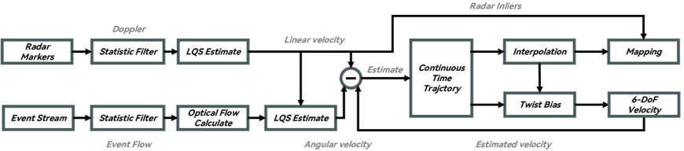
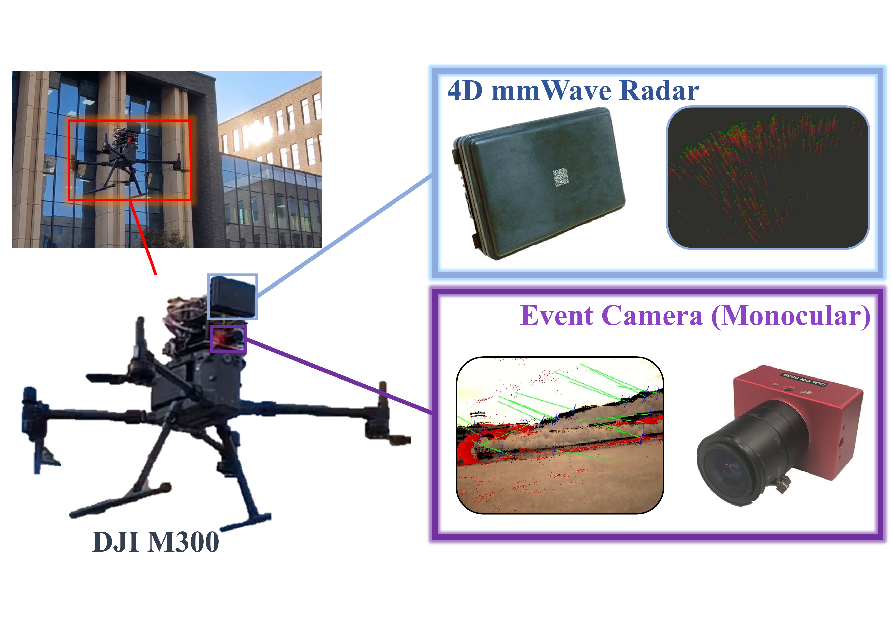

<div align="center">
    <h1>TwistEstimator</h1>
    <i>An Estimator for Ego-Motion Twist Using 4D-MMWave Radar Doppler and Asynchronous Event Streams</i>
    <br>
    <br>


[🧩 Installation](#dependency) |
[🎬 Video](https://youtu.be/l6CFHe1b_40) |
[📖 Paper](https://arxiv.org/abs/2506.18443) (**Under Review**)
</div>


<div align="center">

</div>

## What is TwistEstimator
The TwistEstimator is designed to provide complementary 6-DoF velocity estimation without relying on an IMU. It leverages linear velocity from the millimeter-wave radar and angular velocity from event-based optical flow. By integrating these measurements within a continuous estimation framework, 6-DoF pose estimation is achieved. Furthermore, the system simultaneously calibrates the external parameters and time delay between the millimeter-wave radar and event optical flow. This lightweight odometry solution is intended as an alternative to traditional IMU-based methods.

<div align="center">

</div>

## Supported Dataset

We conducted recordings of 10 datasets across three different scenarios. Each setup is equipped with a 4D millimeter-wave radar (ARS548), an event camera (DAVIS346), an IMU device (Parker IMU), as well as DJI M300 flight controller and RTK data. The characteristics of each data sequence and their respective download links are detailed below:

| Scene Type | Sequence ID | Platform   | Duration (s) | Download Link |
|:----------:|:-----------:|:----------:|:------------:|:--------------:|
| Building   | dji1        | Drone      | 113          | *[Open Later]*       |
| Building   | dji2        | Drone      | 60           | *[Open Later]*       |
| Building   | dji3        | Drone      | 203          | *[Open Later]*       |
| Road       | dji4        | UGV        | 222          | *[Open Later]* |
| Road       | dji5        | UGV        | 375          | *[Open Later]* |
| Road       | dji6        | UGV        | 200          | *[Open Later]* |
| Semi-Open  | dji7        | Drone      | 235          | *[Open Later]*       |
| Semi-Open  | dji8        | Drone      | 140          | *[Link](https://drive.google.com/file/d/1_TYcgjjoqeNRTACs-q52P7NOeHFJCRcw/view?usp=drive_link)*|
| Semi-Open  | dji9        | Drone      | 172          | *[Link](https://drive.google.com/file/d/1setY1U0YBwKR27l1LPJvBCsmQ3_kxA3S/view?usp=drive_link)*|
| Semi-Open  | dji10       | Drone      | 61           | *[Open Later]*       |

**NOTICE:** Radar data and the trigger (timestamp) are provided as separate recordings, in `/pcl2_visualize_2` and `/radar/trigger` . Need to be associated during data processing!

## Dependency
TwistEstimator is developed based on ROS1 and may be extended to ROS2 in the future. In the author's pc environment, the third-party dependencies required by the code are as follows:
- ROS: Noetic
- Optimization: [Eigen](https://gitlab.com/libeigen/eigen.git), [Ceres-1.14.0](https://github.com/ceres-solver/ceres-solver.git)
- Visual Library: [OpenCV-4.2.0](https://github.com/opencv/opencv/releases/tag/4.2.0) **same as ROS Noetic**
- Datatype: 
    [ti_mmwave_rospkg](https://github.com/radar-lab/ti_mmwave_rospkg.git) 
    [dvs_msgs](https://github.com/davidtr99/dvs_msgs) 
    [pcl_ros / pcl_conversions v1.7.4](https://github.com/ros-perception/perception_pcl.git) **same as ROS Noetic**
- GUI: Rviz, OpenGL
- DataLoader: yaml-cpp
- Logfile: glog

Although major dependencies are included in the third-party folder, you may still need to run the script `install_deps.sh` to install libraries like Boost, etc.

## Build
Some dependencies are configured using terminal commands:
```
sudo apt-get install ros-noetic-pcl-ros ros-noetic-pcl-conversions ros-noetic-cv-bridge yaml-cpp
```
After install [Ceres-1.14.0](https://github.com/ceres-solver/ceres-solver.git) and [OpenCV-4.2.0](https://github.com/opencv/opencv/releases/tag/4.2.0), you can install the TwistEstimator project by following these steps:
```
mkdir -p [path_to_dir]/src
cd [path_to_dir]/src
git clone --recursive https://github.com/ZzhYgwh/TwistEstimator.git
git clone https://github.com/radar-lab/ti_mmwave_rospkg.git
git clone https://github.com/davidtr99/dvs_msgs.git

cd ..
catkin build 

or 

catkin_make
```

## Run
After modifying the config file for your environment, you can run TwistEstimator.
```
source ../../devel/setup.bash
roslaunch twist_estimator estimator.launch
```

## Citation

If you use this project for any academic work, please cite our paper [paper](https://arxiv.org/abs/2506.18443).

```
@misc{lyu2025radareventcamerafusion,
      title={Radar and Event Camera Fusion for Agile Robot Ego-Motion Estimation}, 
      author={Yang Lyu and Zhenghao Zou and Yanfeng Li and Chunhui Zhao and Quan Pan},
      year={2025},
      eprint={2506.18443},
      archivePrefix={arXiv},
      primaryClass={cs.RO},
      url={https://arxiv.org/abs/2506.18443}, 
}
```

## Contributing

TwistEstimator is currently in develop version, and we are actively working on it. We welcome community users to participate in this project.

## Acknowledgement
Thanks for these pioneering works:
[Basalt](https://cvg.cit.tum.de/research/vslam/basalt) (Batch Optimization),
[clic](https://github.com/APRIL-ZJU/clic) (Trajctory Manage),
[4DRadarSLAM](ttps://github.com/zhuge2333/4DRadarSLAM) (Radar Ego Estimation).

<div align="center">

[](https://star-history.com/#ZzhYgwh/TwistEstimator&Date)

<div>